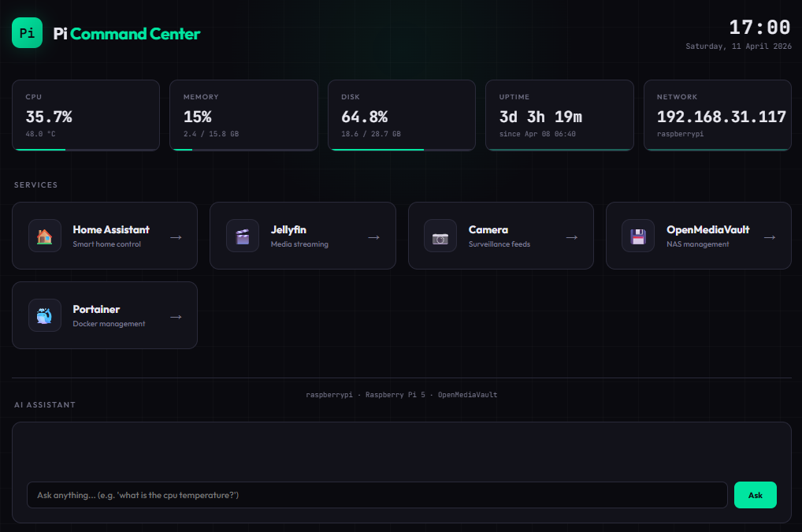
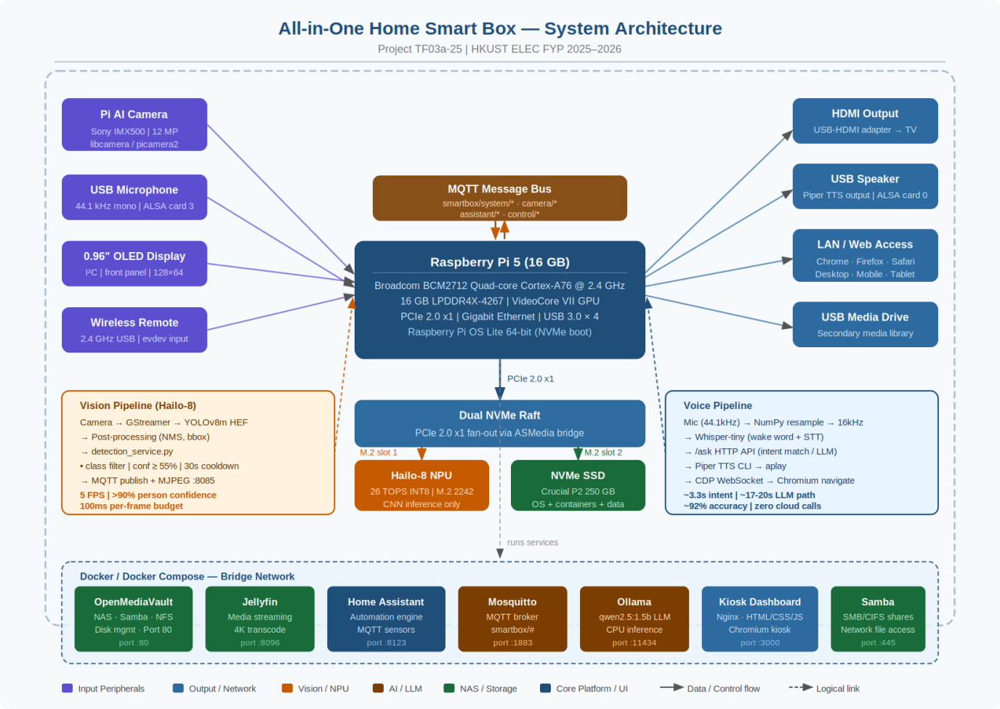
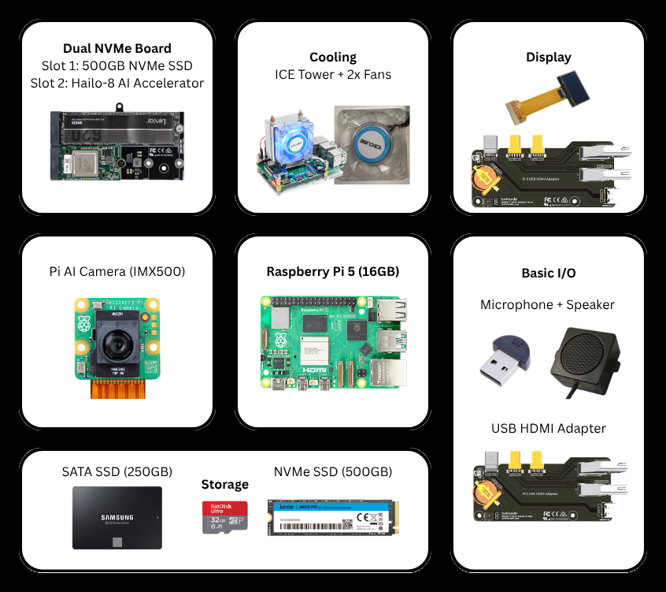

# All-in-One Home Smart Box

A self-contained smart-home appliance on a Raspberry Pi 5 with a Hailo-8 NPU. It boots straight into a kiosk dashboard and handles **object detection, an LLM assistant, voice control, media streaming, home automation, and NAS** — with **zero cloud calls**. Everything runs on the box.



> HKUST ELEC/CPEG Final Year Project · TF03a-25 · 2025–2026 · Supervisor: Prof. TU Fengbin

---

## Why

Smart homes have become a pile of disconnected silos: a streaming box, a separate automation hub, a separate NAS, a separate camera app — each with its own remote, its own app, and its own cloud account quietly shipping your living room to someone else's server. This project collapses all of it onto one device that never phones home.

## Architecture



Everything is glued together by an **MQTT message bus** rather than direct calls between modules. Each subsystem publishes to its own topic namespace and subscribes to what it cares about, so the detection service knows nothing about Home Assistant and the voice pipeline knows nothing about the camera. Adding a consumer means subscribing to a topic, not editing another module.

```
smartbox/camera/status       online/offline heartbeats (retained)
smartbox/camera/detections   per-detection JSON: class, confidence, bbox, track_id, timestamp
smartbox/camera/alerts       higher-severity events that trigger Home Assistant automations
```

| Layer | Stack |
|---|---|
| OS | Raspberry Pi OS Lite 64-bit, booted from NVMe |
| Kiosk | Xorg + Openbox + Chromium, full-screen, auto-login |
| Dashboard | Single-file HTML served by nginx on `:3000` |
| System stats | Dependency-free Python HTTP server reading `/proc` |
| Vision | YOLOv8m on the Hailo-8 NPU via GStreamer → MQTT + MJPEG |
| Assistant | Regex intent matcher, falling back to `qwen2.5:1.5b` on Ollama |
| Voice | Whisper STT + Piper TTS, custom wake word, USB mic/speaker |
| Containers | Home Assistant · Jellyfin · Mosquitto · Ollama · OpenMediaVault · Samba · Portainer |

## Hardware



| Component | Role |
|---|---|
| Raspberry Pi 5 (16 GB) | BCM2712 quad Cortex-A76 @ 2.4 GHz, PCIe 2.0 x1 |
| Hailo-8 NPU (26 TOPS INT8) | M.2 2242, CNN inference only |
| Dual NVMe board | PCIe fan-out — slot 1 SSD, slot 2 Hailo-8 |
| NVMe SSD | OS, containers, data |
| Pi AI Camera (Sony IMX500) | 12 MP, via libcamera/picamera2 |
| 0.96" OLED, USB mic, speaker, IR remote | Front-panel I/O |
| ICE Tower cooler + case fans | Thermal headroom in a TV-box form factor |

The Hailo-8 replaced the originally proposed **Hailo-8L (13 TOPS)** once it became clear YOLOv8m at a real-time frame rate wouldn't leave headroom for a second model. A discrete GPU was rejected outright — the power draw and thermals contradict a quiet living-room box.

---

## The three AI subsystems

### 1. Vision — YOLOv8m on the NPU

`services/detection_service.py` hooks the Hailo GStreamer pipeline callback, so inference never touches the CPU.

```
Camera → GStreamer → YOLOv8m (HEF, on NPU) → NMS/bbox
   → class filter · confidence ≥ 55% · 30 s per-class cooldown
   → MQTT publish + MJPEG stream on :8085
```

**5 FPS sustained, >90% confidence on person detections, ~100 ms per-frame budget.** The 30-second cooldown is what makes it usable in practice — without it a person standing in frame generates a detection event every 200 ms and floods both the broker and Home Assistant's notification path.

### 2. Assistant — intent matcher in front of an LLM

`services/ai_assistant.py` exposes an HTTP API on `:8086`. A regex intent matcher answers deterministic queries (CPU temperature, disk usage, "open Jellyfin") **instantly**; anything it doesn't recognise falls through to `qwen2.5:1.5b` on Ollama.

That two-tier design is the whole trick. Running every "what's the CPU temp" through a 1.5B model on a CPU costs ~17–20 s. Matching it costs milliseconds. The LLM is reserved for the open-ended queries that actually need it.

It also does **vision-language grounding**: the assistant can pull current detections and answer *"what do you see?"* with something like `"2 person detections (highest confidence: 97%)"` — the CNN supplies the facts, the LLM supplies the sentence.

### 3. Voice — wake word to spoken reply, fully local

`services/voice_pipeline.py` chains five components plus a browser bridge:

```
USB mic → Whisper (wake word + STT) → assistant (intent | LLM)
   → Piper TTS → USB speaker
   → Chrome DevTools Protocol → kiosk navigates
```

Saying *"Smart Box, open Jellyfin"* both answers aloud **and** drives the on-screen Chromium to Jellyfin, over a CDP WebSocket on port 9222.

**Measured at ~92% command-execution accuracy across 50 scripted commands** spanning media, status, monitoring and navigation — against an 80% target. Latency splits by path: **~3.3 s** when the intent matcher handles it, **~17–20 s** when it falls through to the LLM.

Whisper mishears the wake word constantly, so matching is three-tier: exact match, then a known-mishearing table (`smart fox`, `smart blocks`), then `smart` + any short word. Real transcripts like *"Jelly Fan"* still route to Jellyfin.

---

## Repo layout

```
dashboard/
  index.html            # single-file dashboard — stats, service cards, chat widget
  pi-stats.py           # /stats JSON endpoint on :5050, polled every 5 s
services/
  detection_service.py  # Hailo NPU + MQTT + MJPEG (:8085)
  camera_stream.py      # standalone MJPEG — use this OR detection, not both
  ai_assistant.py       # intent matcher + Ollama + MQTT + HTTP API (:8086)
  voice_pipeline.py     # wake word + STT + TTS + kiosk navigation via CDP
kiosk-extension/        # Chromium extension: floating "back to dashboard" button
nginx/dashboard.conf    # reverse proxy: / · /stats · /ask
systemd/                # five units + getty auto-login drop-in
scripts/kiosk.sh        # X + Chromium launcher, --remote-debugging-port=9222
SETUP-GUIDE.md          # full step-by-step deployment
```

## Deployment

| File | Destination |
|---|---|
| `dashboard/index.html` | `/var/www/dashboard/index.html` |
| `dashboard/pi-stats.py` | `/usr/local/bin/pi-stats.py` |
| `scripts/kiosk.sh` | `/usr/local/bin/kiosk.sh` (chmod +x) |
| `kiosk-extension/*` | `/home/pi/kiosk-ext/` |
| `nginx/dashboard.conf` | `/etc/nginx/sites-available/dashboard`, then symlink |
| `systemd/*.service` | `/etc/systemd/system/` |
| `systemd/getty-autologin.conf` | `/etc/systemd/system/getty@tty1.service.d/autologin.conf` |
| `services/*.py` | `/home/pi/hailo-apps/` |

```bash
systemctl daemon-reload
systemctl enable --now pi-stats kiosk detection ai-assistant voice-pipeline
```

`SETUP-GUIDE.md` covers auto-login, sudoers, udev rules, and the OpenMediaVault port clash — OMV claims `:80`, so the dashboard was moved to `:3000`.

### Configuration

| Setting | File | Purpose |
|---|---|---|
| `PI_LAN_IP` | `ai_assistant.py` | LAN IP used in navigation responses |
| `MONITORED_CLASSES` | `detection_service.py` | Which COCO classes raise alerts |
| `OLLAMA_MODEL` | `ai_assistant.py` | Any model available in your Ollama |
| `PIPER_MODEL` | `voice_pipeline.py` | Path to a Piper `.onnx` voice |

---

## Limitations

- **Single prototype.** One unit, bench-tested. No sustained thermal soak, no long-term reliability data.
- **LLM latency.** ~17–20 s on CPU is fine for "describe the scene", too slow for conversation. A smaller quantised model or NPU-side LLM would be the fix.
- **Vision and standalone streaming are mutually exclusive** — `detection_service.py` and `camera_stream.py` both claim the camera.
- **Voice accuracy measured on scripted commands** read by project members in a quiet room. Accented, distant, or noisy speech is untested.
- **Detection is person-focused.** Confidence and cooldown thresholds were tuned for people, not pets or packages.
- **No authentication.** Everything trusts the LAN. Exposing this to the internet as-is would be a bad idea.

## Credits

Final Year Project TF03a-25, HKUST · **CHIN Zan Yang** and **Pranav Agarwal** · supervised by Prof. TU Fengbin.

The split, per the final report:

| | |
|---|---|
| **CHIN Zan Yang** | Component selection and procurement, enclosure design and schematics, hardware assembly and validation, IR remote integration |
| **Pranav Agarwal** | OS and hardware software layer, MQTT communication fabric, kiosk dashboard, AI assistant, Hailo-8 vision pipeline, vision-language integration, voice pipeline |

**This repository contains the software** — which corresponds to the second row. Figures are from the final report.
